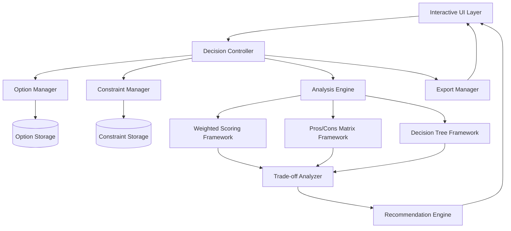

# Design Document: Decision Helper Tool

## Overview

The Decision Helper Tool is a comprehensive comparison and analysis system that helps users make informed decisions by evaluating multiple options against weighted criteria. The system transforms subjective preferences into objective analysis through structured frameworks, providing trade-off insights rather than simple recommendations.

The tool supports various decision scenarios including API selection, cloud service evaluation, tech stack comparison, and general option analysis. It emphasizes transparency in decision-making by showing methodology, assumptions, and reasoning behind recommendations.

## Architecture

The system follows a modular architecture with clear separation between data management, analysis engines, and presentation layers:



## Components and Interfaces

### Option Manager
Handles option input, validation, and storage. Supports flexible option types with extensible metadata schemas.

```typescript
interface Option {
  id: string;
  name: string;
  type: OptionType; // API, CloudService, TechStack, Generic
  metadata: Record<string, any>;
  characteristics: Characteristic[];
}

interface Characteristic {
  name: string;
  value: string | number | boolean;
  category: CharacteristicCategory; // Cost, Performance, Complexity, etc.
}
```

### Constraint Manager
Manages user-defined constraints and priorities with validation and conflict detection.

```typescript
interface Constraint {
  id: string;
  name: string;
  type: ConstraintType; // Budget, Timeline, Technical, Business
  weight: number; // 1-5 priority scale
  criteria: ConstraintCriteria;
}

interface ConstraintCriteria {
  operator: ComparisonOperator; // LessThan, GreaterThan, Equals, Contains
  targetValue: any;
  tolerance?: number;
}
```

### Analysis Engine
Core analysis system supporting multiple decision-making frameworks with pluggable architecture.

```typescript
interface AnalysisFramework {
  name: string;
  analyze(options: Option[], constraints: Constraint[]): AnalysisResult;
  supportsRealTimeUpdates(): boolean;
}

interface AnalysisResult {
  rankings: OptionRanking[];
  tradeOffs: TradeOffAnalysis[];
  recommendations: Recommendation[];
  methodology: MethodologyExplanation;
}
```

### Trade-off Analyzer
Generates structured trade-off analysis showing advantages, disadvantages, and contextual implications.

```typescript
interface TradeOffAnalysis {
  optionId: string;
  advantages: TradeOffPoint[];
  disadvantages: TradeOffPoint[];
  contextualFactors: ContextualFactor[];
  riskAssessment: RiskLevel;
}

interface TradeOffPoint {
  description: string;
  impact: ImpactLevel; // High, Medium, Low
  timeframe: Timeframe; // ShortTerm, LongTerm, Ongoing
  affectedConstraints: string[]; // Constraint IDs
}
```

## Data Models

### Decision Context
Encapsulates the complete decision scenario including options, constraints, and analysis state.

```typescript
interface DecisionContext {
  id: string;
  title: string;
  description: string;
  options: Option[];
  constraints: Constraint[];
  selectedFramework: AnalysisFramework;
  analysisResults?: AnalysisResult;
  userNotes: string;
  createdAt: Date;
  updatedAt: Date;
}
```

### Comparison Frameworks

#### Weighted Scoring Model
Implements quantitative scoring with normalized weights and dimensional consistency.

```typescript
interface WeightedScoringConfig {
  criteria: ScoringCriterion[];
  normalizationMethod: NormalizationMethod;
  aggregationMethod: AggregationMethod; // Additive, Multiplicative
}

interface ScoringCriterion {
  name: string;
  weight: number;
  scale: ScoreScale; // 1-5, 1-10, Percentage
  scoringFunction: (option: Option) => number;
}
```

#### Pros/Cons Matrix
Structured qualitative analysis with categorized advantages and disadvantages.

```typescript
interface ProsConsMatrix {
  optionId: string;
  categories: ProsConsCategory[];
  overallAssessment: QualitativeAssessment;
}

interface ProsConsCategory {
  name: string;
  pros: QualitativePoint[];
  cons: QualitativePoint[];
  netAssessment: NetAssessment;
}
```

## Correctness Properties

*A property is a characteristic or behavior that should hold true across all valid executions of a system-essentially, a formal statement about what the system should do. Properties serve as the bridge between human-readable specifications and machine-verifiable correctness guarantees.*

Before writing the correctness properties, I need to analyze the acceptance criteria from the requirements document to determine which are testable as properties, examples, or edge cases.

Based on the prework analysis, I'll now convert the testable acceptance criteria into correctness properties:

### Property 1: Option Data Integrity
*For any* option with characteristics, storing then retrieving the option should preserve all characteristics and metadata exactly as provided, with proper validation applied during input.
**Validates: Requirements 1.1, 1.2**

### Property 2: Option Capacity Constraints  
*For any* comparison session, the system should accept between 2 and 10 options inclusive, rejecting attempts to add fewer than 2 or more than 10 options.
**Validates: Requirements 1.3**

### Property 3: Metadata Prompting Consistency
*For any* option type being added, the system should prompt for all relevant metadata fields appropriate to that option type.
**Validates: Requirements 1.4**

### Property 4: Constraint Classification Accuracy
*For any* user-defined constraint, the system should correctly categorize it by type and accept only valid priority weights between 1-5 inclusive.
**Validates: Requirements 2.1, 2.2**

### Property 5: Conflict Detection Reliability
*For any* set of constraints that contain logical conflicts, the system should identify all conflicts and provide resolution suggestions.
**Validates: Requirements 2.4**

### Property 6: Comprehensive Analysis Generation
*For any* valid set of options and constraints, the analysis should include comparative evaluation across all relevant dimensions, showing both advantages and disadvantages for each option relative to the constraints.
**Validates: Requirements 3.1, 3.2, 3.3**

### Property 7: Analysis Categorization Consistency
*For any* complex trade-off analysis, the system should organize findings into appropriate categories (short-term vs long-term, technical vs business impact) for improved comprehension.
**Validates: Requirements 3.4**

### Property 8: Framework Execution Reliability
*For any* selected comparison framework, the system should guide users through the appropriate evaluation process and produce accurate calculations with explanations, while allowing seamless switching between frameworks.
**Validates: Requirements 4.2, 4.3, 4.4**

### Property 9: Context-Aware Recommendation Logic
*For any* decision context, recommendations should incorporate all relevant factors (constraints, timeline, expertise), highlight differentiating factors when options score similarly, and provide clear reasoning and assumptions.
**Validates: Requirements 5.1, 5.2, 5.4**

### Property 10: Sensitivity Analysis Accuracy
*For any* constraint modification, the system should update rankings and recommendations appropriately, showing how changes affect the decision outcome.
**Validates: Requirements 5.3**

### Property 11: Export Completeness and Customization
*For any* completed analysis, exports should include all analysis components (methodology, assumptions, rationale) and incorporate any user-added notes or custom content.
**Validates: Requirements 6.1, 6.3, 6.4**

### Property 12: Real-time Interface Responsiveness
*For any* user interaction (weight changes, hover actions, filtering), the interface should update immediately with appropriate detailed information and maintain consistency across all views.
**Validates: Requirements 7.1, 7.2, 7.4**

## Error Handling

The system implements comprehensive error handling across all components:

### Input Validation Errors
- **Invalid Option Data**: Graceful handling of malformed option characteristics with specific error messages
- **Constraint Conflicts**: Clear identification of conflicting constraints with suggested resolutions
- **Capacity Violations**: Informative messages when option limits are exceeded

### Analysis Errors
- **Insufficient Data**: Guidance when analysis cannot proceed due to missing information
- **Framework Failures**: Fallback mechanisms when specific frameworks encounter errors
- **Calculation Errors**: Validation of numerical computations with error recovery

### Export Errors
- **Format Failures**: Alternative format suggestions when preferred export format fails
- **Data Integrity**: Verification that exported data matches analysis results
- **Permission Issues**: Clear messaging for file system or access-related export problems

### Real-time Update Errors
- **State Synchronization**: Recovery mechanisms when UI state becomes inconsistent
- **Performance Degradation**: Graceful handling of complex analyses that may impact responsiveness
- **Network Issues**: Offline capability and sync recovery for web-based implementations

## Testing Strategy

The testing approach combines unit testing for specific scenarios with property-based testing for comprehensive validation of universal properties.

### Unit Testing Focus
- **Specific Framework Examples**: Test each comparison framework with known input/output pairs
- **Edge Cases**: Boundary conditions like exactly 2 options, maximum constraints, tie scenarios
- **Error Conditions**: Invalid inputs, malformed data, system limits
- **Integration Points**: Component interactions and data flow validation

### Property-Based Testing Configuration
- **Testing Framework**: Use fast-check for JavaScript/TypeScript implementation
- **Test Iterations**: Minimum 100 iterations per property test for thorough coverage
- **Generator Strategy**: Smart generators that create realistic option and constraint combinations
- **Property Validation**: Each property test references its corresponding design document property

### Test Organization
```typescript
// Example property test structure
describe('Decision Helper Properties', () => {
  test('Property 1: Option Data Integrity', () => {
    // **Feature: decision-helper, Property 1: Option Data Integrity**
    fc.assert(fc.property(
      optionGenerator(),
      (option) => {
        const stored = decisionHelper.addOption(option);
        const retrieved = decisionHelper.getOption(stored.id);
        return deepEqual(retrieved.characteristics, option.characteristics);
      }
    ), { numRuns: 100 });
  });
});
```

### Dual Testing Benefits
- **Unit tests** catch concrete bugs and validate specific examples
- **Property tests** verify universal correctness across all possible inputs
- **Combined coverage** ensures both specific functionality and general robustness
- **Regression protection** through comprehensive test suites that validate all system properties